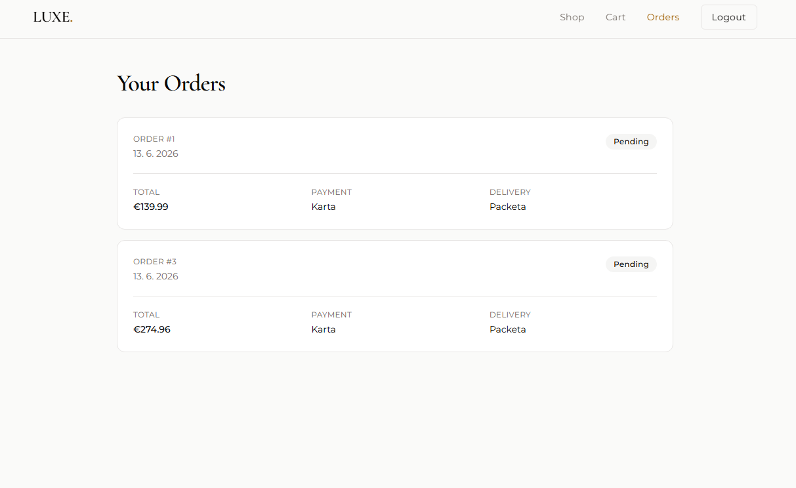

# LUXE — Premium Fashion E-Commerce

A full-stack e-commerce application for a premium fashion store. Built with React, Node.js, Express, and MySQL, featuring JWT authentication, role-based access control, a shopping cart, order processing with database transactions, and a complete admin dashboard.

🔗 **Live demo:** [ecommerce-alpha-one-51.vercel.app](https://ecommerce-alpha-one-51.vercel.app)

> **Demo account** — email: `vance@gmail.com` · password: `123456`
>
> _Note: the backend is hosted on Render's free tier and may take ~30 seconds to wake up on the first request._




## Features

**Customer**

- Browse products in a responsive grid with category filtering
- View detailed product pages with stock availability
- Add items to cart, adjust quantities, and remove items
- Checkout with payment and delivery method selection
- View order history

**Authentication & Security**

- User registration and login with JWT authentication
- Passwords hashed with bcrypt
- Role-based access control (user / admin)
- Protected routes on both backend and frontend

**Admin**

- Full product CRUD (create, read, update, delete)
- Image, category, price, and stock management
- Admin-only dashboard guarded by role verification

**Business logic**

- Stock validation — orders are rejected if quantity exceeds available stock
- Automatic stock reduction on successful orders
- Database transactions ensure orders, order items, and cart cleanup happen atomically
- Cart merges duplicate products by increasing quantity

## Tech Stack

**Frontend**

- React (Vite)
- React Router
- Tailwind CSS + shadcn/ui
- Axios

**Backend**

- Node.js + Express
- MySQL (mysql2)
- JWT (jsonwebtoken)
- bcryptjs

**Deployment**

- Frontend: Vercel
- Backend: Render
- Database: Clever Cloud (MySQL)

## Database Schema

The application uses six related tables:

- `users` — accounts with role (user/admin)
- `categories` — product categories
- `products` — product catalog with stock and image
- `cart` — per-user shopping cart
- `orders` — placed orders with status, payment, and delivery
- `order_items` — line items linking orders to products (with price snapshot)

## API Endpoints

**Auth**

- `POST /api/auth/register` — register a new user
- `POST /api/auth/login` — log in and receive a JWT
- `GET /api/auth/me` — get current user (protected)

**Products**

- `GET /api/products` — list all products
- `GET /api/products/:id` — get a single product
- `POST /api/products` — create a product (admin)
- `PUT /api/products/:id` — update a product (admin)
- `DELETE /api/products/:id` — delete a product (admin)

**Cart**

- `GET /api/cart` — get the current user's cart (protected)
- `POST /api/cart` — add a product to the cart (protected)
- `PUT /api/cart/:id` — update item quantity (protected)
- `DELETE /api/cart/:id` — remove an item (protected)

**Orders**

- `GET /api/orders` — list the user's orders (protected)
- `GET /api/orders/:id` — get a single order (protected)
- `POST /api/orders` — place an order from the cart (protected, transactional)

**Categories**

- `GET /api/categories` — list all categories

## Running Locally

### Prerequisites

- Node.js
- A MySQL database (local via XAMPP, or a cloud provider)

### Backend

```bash
cd server
npm install
```

Create a `.env` file in `server/`:

```
DB_HOST=
DB_USER=root
DB_PASSWORD=
DB_NAME=
DB_PORT=3306
PORT=5000
JWT_SECRET=
```

Then start the server:

```bash
node index.js
```

### Frontend

```bash
cd client
npm install
```

Create a `.env.development` file in `client/`:

```
VITE_API_URL=
```

Then start the dev server:

```bash
npm run dev
```

The app will be available at `http://localhost:5173`.

## Author

**Dávid** — [github.com/Ha-Khu](https://github.com/Ha-Khu)
